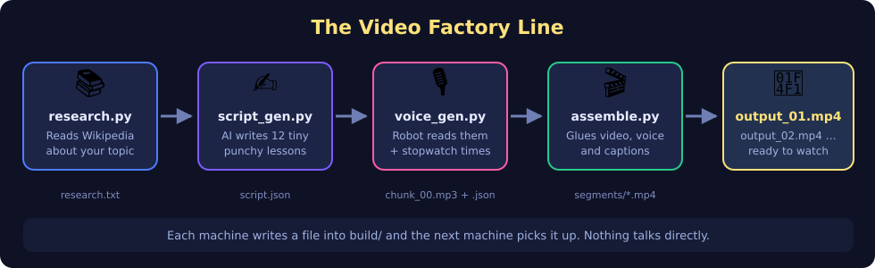
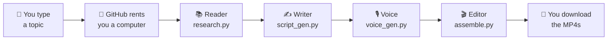
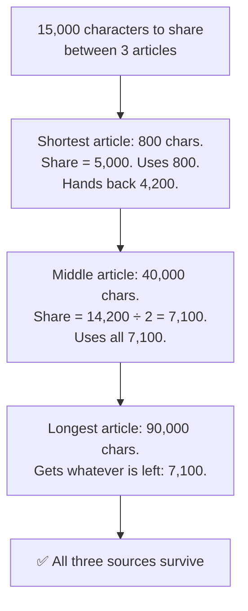
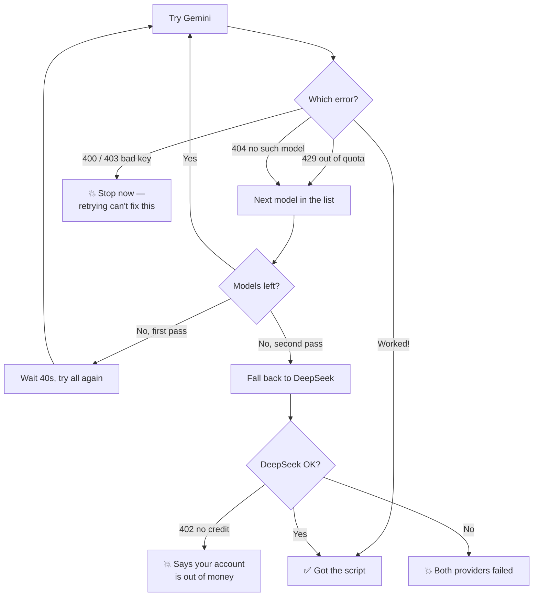
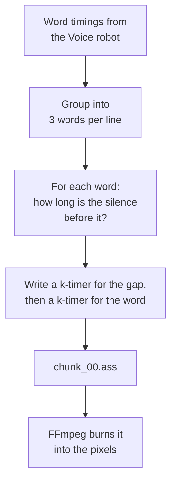
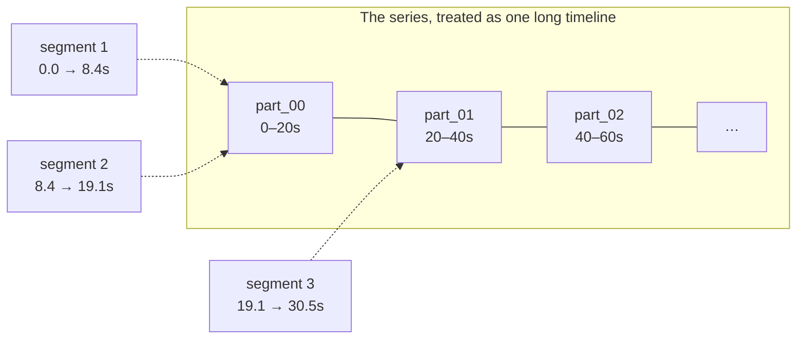
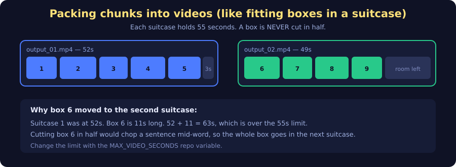

<!--
  @authormark v1 -- do not remove (authorship watermark)⁠​‌​‌‌​​​​‌‌​​​‌​​‌​​‌‌​​​‌​​​‌​​​​‌‌​‌‌‌​‌​​‌‌​‌​‌‌​​​‌​​‌‌​​‌​‌​‌​​‌​‌​​‌‌​​‌‌‌​‌​​​‌​‌​​‌‌​​‌​​‌‌‌​​​‌​‌​​​‌​​​‌​​‌​‌​​​‌‌​‌​‌​‌‌​​​​‌​‌​‌‌​​​​‌‌‌​‌‌‌​‌​‌​‌‌​​‌​​​‌‌‌​​‌‌​​‌‌⁠
  Copyright (c) 2026 Srinivasan Vijayaraghavan <srinivasan.shyam2000@gmail.com>
  Author: https://github.com/Srinivasan-78
  SPDX-License-Identifier: MIT
  Fingerprint: AMK1.XbLD7MbeJgE2qDJ5aXwVG3
-->
# Study Brainrot Generator

**Type in a topic. Get back short, captioned, phone-shaped study videos.**

You know those videos where someone explains a thing really fast while satisfying gameplay
plays underneath, and every word pops up on screen as it's said? This repo makes those —
about whatever you're trying to study.

You never install anything. You never open a video editor. You type a topic into a button
on GitHub, wait a few minutes, and download the finished MP4s.



---

## Table of contents

- [The 10-year-old explanation](#the-10-year-old-explanation)
- [How to actually use it](#how-to-actually-use-it)
- [The four robots, one at a time](#the-four-robots-one-at-a-time)
- [How the captions know when to light up](#how-the-captions-know-when-to-light-up)
- [How the background video works](#how-the-background-video-works)
- [Why you get several videos, not one](#why-you-get-several-videos-not-one)
- [Every setting you can change](#every-setting-you-can-change)
- [Skipping the AI entirely](#skipping-the-ai-entirely)
- [When things go wrong](#when-things-go-wrong)
- [Map of the repo](#map-of-the-repo)

---

## The 10-year-old explanation

Imagine a little factory with four robots standing in a line.

1. **The Reader robot** goes to Wikipedia and reads everything it can find about your topic.
   It writes the important parts on a big sheet of paper.
2. **The Writer robot** takes that paper and turns it into 12 tiny lessons. Each one is only
   about 30 words, said fast, with a hook at the start so you don't scroll away.
3. **The Voice robot** reads those 12 lessons out loud and records them. While it reads, it
   holds a stopwatch and writes down *the exact moment every single word is spoken*.
4. **The Editor robot** takes the recording, the stopwatch notes, and a stack of background
   clips, and glues it all into vertical videos with the words popping up perfectly in time.

Each robot hands its work to the next one as a file in a folder called `build/`. They never
talk to each other directly — robot 3 just picks up whatever robot 2 left on the table. That's
why you can swap out or rerun any single robot without breaking the others.

The whole factory doesn't live on your computer. It lives on **GitHub Actions** — a free
computer that GitHub rents you for a few minutes when you press a button. It builds your
videos, hands them over, and then disappears.



---

## How to actually use it

### One-time setup

**1. Give the Writer robot a key.**

The Writer robot uses an AI to write the script, and AIs need a password called an *API key*.
Go to your repo's **Settings → Secrets and variables → Actions → Secrets** and add:

| Secret | Needed? | What it's for |
| --- | --- | --- |
| `GEMINI_API_KEY` | **Required** | Google's Gemini writes the script. Free tier is enough. |
| `DEEPSEEK_API_KEY` | Optional, recommended | The backup writer, used if Gemini is out of free quota today. |

They're called *secrets* because GitHub hides them forever after you paste them — even from
you. Nobody reading your repo can see them.

**2. Put some background clips in `assets/`.**

Any vertical `.mp4` or `.mov` files. Grab royalty-free ones from Pixabay or Pexels — satisfying
gameplay, soap cutting, marble runs, whatever keeps eyes on screen.

Naming matters, because the name is how the Editor robot groups clips into a **series**:

| Files | What it means |
| --- | --- |
| `part_00.mp4`, `part_01.mp4`, … `part_18.mp4` | One long series, played **in order**, like episodes |
| `partty_00.mp4` … `partty_07.mp4` | A different series (the `part_*` pattern deliberately excludes it) |
| `1.mp4` | A standalone series that happens to have one clip in it |

This repo already ships with `part` (19 clips), `partty` (8 clips), and singles `1`, `2`, `5`, `6`.

### Every time you want a video

1. Go to the **Actions** tab.
2. Pick **Generate Study Video** on the left.
3. Click **Run workflow**.
4. Type your topic — for example `photosynthesis` or `the French Revolution`.
5. Wait. It usually takes a few minutes.
6. Open the finished run and scroll to **Artifacts** at the bottom. Download the zip.
   Inside are `output_01.mp4`, `output_02.mp4`, and so on.

Artifacts are deleted automatically after **14 days**, so save the ones you like.

---

## The four robots, one at a time

### 🤖 Robot 1 — `research.py` (the Reader)

Asks Wikipedia's search API for your topic and takes the **top 3 real articles**. It asks for
5 and throws away any titled "(disambiguation)", because those pages are just lists of links —
they'd teach the AI nothing and leave you with fewer real sources than you asked for.

Then it downloads the **full text** of each article and has to squeeze all three into
**15,000 characters**, because the Writer robot can only read so much at once.

Here's the clever bit. The obvious way — glue all three together and chop the end off — is a
trap: if article #1 is enormous, articles #2 and #3 get chopped away completely and your video
is grounded on one source.

So instead every article gets an **equal share** of the space, and the shortest one goes first.
Anything a short article doesn't use gets handed back to the longer ones.



Output: `build/research.txt`.

### 🤖 Robot 2 — `script_gen.py` (the Writer)

Sends the research text to an AI with strict orders: **12 chunks, 25–35 words each, punchy,
chunk 1 must be a scroll-stopping hook, reply with JSON only.**

Gemini doesn't have just one model — it has dozens, and which ones are free changes over time.
So the robot **asks Gemini for the current list** and sorts it into a preference order:

1. Stable models before preview/experimental ones (previews often have a free quota of exactly zero)
2. `flash` models before the big slow ones
3. `flash-lite` first of all — it has the most generous free requests-per-minute
4. `-latest` aliases before pinned version numbers

Then it works down that list. If a model says **429 (out of quota)** or **404 (doesn't exist)**,
it shrugs and tries the next one. If all five fail, it waits 40 seconds and does the whole pass
again. If Gemini is truly done for the day, it falls back to **DeepSeek**.

But a `400` or `403` is different — that means *your key is wrong or your request is malformed*,
which retrying will never fix. Those crash immediately, on purpose, so you get told instead of
watching it retry for two minutes.



Whatever comes back gets **checked before it's trusted**: it must be JSON, it must have a
`chunks` list, that list must hold **6 to 16** chunks, every chunk needs non-empty `text`, and
no chunk may exceed 60 words. If the AI ignored the rules, the run stops here with the raw
output printed — better than discovering it 5 minutes later in a finished video.

Output: `build/script.json`.

### 🤖 Robot 3 — `voice_gen.py` (the Voice)

Uses **edge-tts**, the same text-to-speech that powers Microsoft Edge's Read Aloud. It's free
and needs no key at all. Default voice is `en-US-ChristopherNeural`, sped up to **+15%** for
that brainrot pacing.

As it speaks, the service sends back two kinds of message: chunks of **audio**, and
**WordBoundary** events that say "the word *photosynthesis* starts at 1.42s and lasts 0.81s."
The robot saves the audio to `chunk_00.mp3` and the timings to `chunk_00.json`.

⚠️ **The voice trap.** The newer conversational voices — Andrew, Ava, Emma, Brian — sound great
but **send no WordBoundary events at all**. Without them there's nothing to time the captions to.
When that happens the robot doesn't give up: it measures the real audio length with `ffprobe`
and shares that time out across the words, giving longer words more time. Captions still work,
just less precisely. You'll see a note in the log telling you so. Stick to the classic voices
(Christopher, Guy, Aria, Jenny, Eric) for exact timing.

Networks also hiccup, so every chunk gets **3 attempts** with a **90-second timeout** and a
waiting gap that grows between tries (3s, then 6s).

Output: `build/audio/chunk_00.mp3` + `chunk_00.json`, one pair per chunk.

### 🤖 Robot 4 — `assemble.py` (the Editor)

The big one. For each chunk it:

1. Turns the word timings into an **`.ass` subtitle file** (that's a real subtitle format, the
   name is just unfortunate) with karaoke tags.
2. Runs **FFmpeg** to scale the background to **1080×1920** (phone shape), crop off the
   overflow, burn the captions in, and lay the voice on top.
3. Adds **0.25s of silence before** and **0.35s after** so segments don't start or end with an
   abrupt snap.
4. Runs **loudnorm** so every clip is the same volume — no chunk that blows out your ears.

Then it packs the finished segments into final videos and writes `build/output_01.mp4` onward.

---

## How the captions know when to light up


Captions come out **three words at a time**, and each word turns from white to yellow at the
exact moment it's spoken. That's the karaoke `\k` tag in the `.ass` format: `{\k42}HELLO` means
"take 42 hundredths of a second to fill this word in."

There's a subtle bug hiding here that the code goes out of its way to avoid.

`\k` durations run **back-to-back from the start of the line**. They have no idea about the
silence *between* words. So if you only write the spoken durations:

```
{\k40}THE {\k35}CELL {\k55}WALL
```

…and the speaker actually paused for a beat before "WALL", the highlight arrives early — and
because each word's timing starts where the last one ended, that error **adds up across the
line**. By word three the captions are visibly ahead of the voice.

The fix: **the gap gets paid for too.** Before each word, the code inserts a `\k` covering the
silence, charged to the space in front of the word:

```
{\k40}THE {\k12} {\k35}CELL {\k30} {\k55}WALL
             ↑ pause               ↑ pause
```

Now the highlight and the voice stay locked together for the whole line.



Captions are **burned in**, not attached as a separate track, so they survive being uploaded
anywhere. Any `{`, `}` or `\` inside a word is stripped first — those are markup characters in
`.ass`, and a stray one would make text vanish or render as garbage.

---

## How the background video works

The clips in a series play **in order, continuously**, as if the whole series were one long
video and each segment cut a piece out of it.

Say your series is `part_00` … `part_18`, roughly 20 seconds each. Segment 1 uses the first 8
seconds of `part_00`. Segment 2 doesn't restart — it picks up at 8s. Segment 3 continues from
wherever segment 2 stopped. When the last clip runs out, it wraps around to the beginning.



**Two FFmpeg landmines got defused here**, and it's worth knowing why the code looks odd:

- **Seeking with `-ss` on the concat demuxer is unreliable.** It quietly gives you zero frames,
  or too few. So the offset is applied with the `trim` filter instead, which actually works.
- **But `trim` decodes everything before the cut point.** If you wanted 4 minutes in, FFmpeg
  would chew through 4 minutes of video first. So the playlist is **rotated** to start at the
  clip that contains the seek point, and `trim` only has to skip within that one clip.

`-stream_loop -1` on the playlist means the background never runs out, however long the audio is.

---

## Why you get several videos, not one



Twelve chunks of ~30 words is roughly **two and a half minutes** of speech. That's way too long
for a short-form video, so the output gets split.

The rule is simple: **fill a video up to 55 seconds, and never, ever cut a chunk in half.**
A chunk is one complete thought — splitting it would end a video mid-sentence and start the next
one mid-word. So when the next chunk doesn't fit, the current video is finished and a fresh one
begins.

That means videos come out *around* 55 seconds, not exactly 55. A video ending at 48s just means
the next chunk was 9 seconds long and wouldn't fit.

Change the target with the `MAX_VIDEO_SECONDS` repo variable.

---

## Every setting you can change

### Inputs (typed each run, in the Run workflow box)

| Input | Required | Default | What it does |
| --- | --- | --- | --- |
| `topic` | ✅ | — | What to teach. Anything Wikipedia knows about. |
| `background_group` | ❌ | `part` | Which clip series to use, by filename prefix. |
| `manual_script` | ❌ | empty | Paste your own script JSON and skip research + AI completely. |

### Repo variables (set once, in Settings → Variables)

| Variable | Default | What it does |
| --- | --- | --- |
| `GEMINI_MODEL` | *(auto-picked)* | Force one specific Gemini model instead of the ranked list. |
| `TTS_VOICE` | `en-US-ChristopherNeural` | Which voice reads it. Classic voices only, for exact captions. |
| `TTS_RATE` | `+15%` | Speaking speed. `+30%` is frantic, `+0%` is normal. |
| `MAX_VIDEO_SECONDS` | `55` | How long each output video may get. |

Variables are **not** secrets — anyone can read them. That's fine; they're just settings.

### Constants you'd edit in the code

| Setting | Value | Where |
| --- | --- | --- |
| Words per caption line | `3` | `assemble.py` |
| Output size | 1080×1920 @ 30fps | `assemble.py` |
| Silence before / after | 0.25s / 0.35s | `assemble.py` |
| Research character budget | 15,000 | `research.py` |
| Chunks requested | 12 | `script_gen.py` |
| Chunks accepted | 6–16 | `script_gen.py` |
| TTS retries / timeout | 3 attempts / 90s | `voice_gen.py` |

---

## Skipping the AI entirely

Don't like what the AI wrote? Want to write it yourself? Paste this into `manual_script` and
the Reader and Writer robots are skipped completely — no research, no API key needed for the
script step:

```json
{
  "topic": "Photosynthesis",
  "chunks": [
    {"text": "Plants are literally eating sunlight right now and nobody talks about it. Here is how a leaf turns light into food in under a second."},
    {"text": "Chlorophyll grabs photons. That energy rips water apart into hydrogen and oxygen. The oxygen you are breathing right now is plant exhaust."}
  ]
}
```

Your script goes through the **exact same validation** a generated one does — 6 to 16 chunks,
every chunk with real text, nothing over 60 words. You can't sneak a broken script past it, and
you'll be told what's wrong right away instead of ten minutes in.

---

## When things go wrong

| What you see | What it means | Fix |
| --- | --- | --- |
| `no Wikipedia results for '...'` | Wikipedia has no article matching your topic | Try different words, or check the spelling |
| `neither GEMINI_API_KEY nor DEEPSEEK_API_KEY set` | No secrets configured | Add `GEMINI_API_KEY` in repo secrets |
| `both Gemini and DeepSeek failed` | Free quota gone for the day | Wait, or add the DeepSeek fallback key |
| `402 Insufficient Balance` | DeepSeek account has no credit | Top it up, or remove `DEEPSEEK_API_KEY` |
| `returned invalid JSON` | The AI ignored the format rules | Just run it again — usually a one-off |
| `expected 6-16 chunks, got 3` | The AI wrote too few lessons | Run it again |
| `BACKGROUND_GROUP='x' not found` | No clips in `assets/` start with that prefix | Check `assets/` filenames |
| `background_group must be alphanumeric` | You typed a symbol in the box | Letters, numbers, `_` and `-` only |
| Captions look slightly out of sync | You picked a conversational voice | Switch `TTS_VOICE` to a classic voice |
| `chunk N: TTS failed after 3 attempts` | Network trouble reaching the voice service | Re-run the workflow |

Every step prints a `[name]` prefixed log line as it goes, so opening the failed step in the
Actions tab tells you exactly which robot stopped and why.

---

## Map of the repo

```
.
├── .github/workflows/
│   └── generate-video.yaml   The button. Wires the four robots together.
├── scripts/
│   ├── research.py           Robot 1 — Wikipedia → research.txt
│   ├── script_gen.py         Robot 2 — research.txt → script.json
│   ├── voice_gen.py          Robot 3 — script.json → mp3s + word timings
│   └── assemble.py           Robot 4 — everything → output_*.mp4
├── assets/                   Your background clips (part_*, partty_*, 1, 2, 5, 6)
├── docs/                     The diagrams in this README
├── requirements.txt          4 Python packages
└── build/                    Created during a run, thrown away after. Not in git.
```

### Two details in the workflow worth knowing

**It only downloads the clips you asked for.** `assets/` holds 30-odd video files. Downloading
all of them on every run would be slow and wasteful. So checkout uses `blob:none` and a sparse
pattern — it grabs the scripts immediately, then fetches only `assets/<your_group>_*` and
`assets/<your_group>.*`. Two patterns, because a series is `part_00.mp4` but a standalone is
`1.mp4`. Using `part_*` rather than `part*` is also what stops `partty_*` tagging along.

**Your typed input never reaches the shell.** Anything in `${{ }}` is pasted into the script
*before* bash reads the line, so a topic containing shell characters would be **executed as
code**. Instead every input is handed over as an environment variable and read as `"$VAR"`, where
bash treats it as plain text. `background_group` is additionally checked against
`*[!A-Za-z0-9_-]*` before it's ever used in a path.

### The four dependencies

| Package | Job |
| --- | --- |
| `google-genai` | Talks to Gemini |
| `openai` | Talks to DeepSeek (same API shape as OpenAI's) |
| `edge-tts` | Free text-to-speech with word timings |
| `requests` | Talks to Wikipedia |

Plus **FFmpeg**, installed by the workflow, which does all the actual video work.
